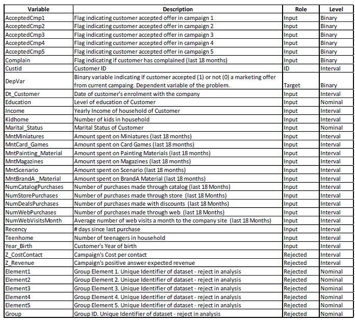

<style>

table, td, th {
  border: none;
  padding-left: 1em;
  padding-right: 1em;
  min-width: 50%;
  margin-left: auto;
  margin-right: auto;
  margin-top: 1em;
  margin-bottom: 1em;
}

</style>

***

```{r setup, include=FALSE}

knitr::opts_chunk$set(warning=FALSE,
                      message=FALSE,
                      echo=FALSE,
                      fig.align="center",
                      fig.path="./Output/")

## Importing packadges
packages <- c("dplyr", "ggplot2", "tidyr", "xlsx", "lubridate", "stringr",
              "scales","kableExtra", "corrplot", "robustbase")
lapply(packages, library, character.only = TRUE)

# NOVA-IMS grey : #5C666C
# NOVA-IMS green : #BED62F

```


```{r entropy function}

compute_IG <- function(x,y){
          
          y <- as.numeric(y)-1
          prob_1 <- sum(y)/length(y)
          i_entropy <- -prob_1*log2(prob_1)-(1-prob_1)*log2(1-prob_1)
          
          df <-  data.frame(predictor=x,target=y) %>% 
                    group_by(predictor) %>% 
                    summarise(class_freq=n(),
                              target_freq=sum(target)) %>% 
                    ungroup() %>% 
                    mutate(class_prob=class_freq/length(y),
                           target_prob=target_freq/class_freq,
                           class_entropy=if_else(target_prob %in% c(1,0),0,
                                                 -target_prob*log2(target_prob)-(1-target_prob)*log2(1-target_prob)))
          
         f_entropy <- sum(df$class_prob*df$class_entropy)
         
         return(i_entropy-f_entropy)
          
}

```


## War Games Company

Welcome to the War Games Stores. This organization is a well-established company operating in the Wargames and Miniatures sector. Presently they have around 250,000 registered customers and serve more than 800,000 consumers a year.

They sell products from 5 major categories: Miniatures, Card games, Painting material, Specialized magazines and Playing scenarios. These five categories can be also be divided in "Brand A" material and other suppliers.

The Customers can order and acquire those products through 3 channel groups: Physical stores, quarterly catalogs and the companies' website.

Globally, the company had solid revenues and a healthy bottom line in the past 4 years, but the profit growth perspectives for the next 3 years are fickle. A few strategic initiatives are being considered to invert the situation. One of those is a Marketing efficiency program to improve marketing activities with a special focus on boosting tremendously the efficiency of the marketing campaigns.


## Problem description

The aim of this analysis is to build a predictive model that will produce the highest profit for the next direct marketing campaign of the company - the sixth campaign this year that is scheduled for next month. The campaign aims at selling a new gadget to the customer database (potential of 250,000 customers).

To be able to build the predictive model, a pilot campaign was carried out. A sample of 2.500 customers were contacted by mail proposing the acquisition of the gadget. During the next 2 months, the customers who bought the offer were tagged with a 1 whereas the non-respondents were tagged with a 0.

The idea is to develop a model that predicts customer behavior and apply this model to the rest of the customer base. Hopefully the model will allow the company to cherry pick the customers that are most likely to purchase the offer, while leaving out the non-responders, making the next campaign highly profitable.


## Dataset description

The dataset used for predictive model development will be "Group_14_WarGames_campaign.xlsx". This dataset includes a priori information about the 2.500 customers contacted but also a posteriori information about who responded positively (1) or not (0) to the offer (`DepVar` variable).

Below you can find a list of variables present in the Datatsets:



```{r input dataset}

raw_data <- read.xlsx2(file = "./Input/Group_14_WarGames_campaign.xlsx",
                       sheetIndex = 1,
                       colIndex = c(1:26,29),
                       colClasses = c("character", "integer", rep("character",2),
                                      "numeric", rep("integer",2), "Date",
                                      "integer", rep("numeric",6), 
                                      rep("integer",5), rep("character",7)),
                       stringsAsFactors=FALSE) %>% 
          mutate(DepVar=factor(DepVar))

raw_data$DepVar <- factor(raw_data$DepVar,levels = rev(levels(raw_data$DepVar)))

campaign_specs <- read.xlsx2(file = "./Input/Group_14_WarGames_campaign.xlsx",
                   sheetIndex = 1,
                   colIndex = c(27:28),
                   endRow = 2,
                   colClasses = rep("numeric",2))

```

In summary, we have 26 variables, excluding the variable custid and all the variables with the role Rejected. From those, 17 are numeric variables and 9 are categorical variables.


## Data overview

### Target variable

The target variable for this analysis is `DepVar`. It is a binary variable, identifying whether or not the customer accepted the campaign's offer. In this dataset, `r percent(nrow(filter(raw_data, DepVar==1))/nrow(raw_data))` of the customers accepted the offer and there are no missing values. Bellow is the frequency plot of this variable:

```{r DepVar overview, fig.height=1.5, fig.width=1.5}

raw_data %>%
          select(DepVar) %>% 
          ggplot(mapping = aes(x=DepVar)) +
          geom_bar(fill="#5C666C")+
          labs(y="Frequency")+
          theme_minimal(base_size = 9) +
          theme(panel.grid=element_blank(),
                axis.title.x =element_blank())
```


### Categorical predictors

```{r cat overview table}
temp <- raw_data %>% 
          select(Education, Marital_Status, AcceptedCmp2:DepVar) %>% 
          gather(key=variable,value=level,-DepVar) %>% 
          group_by(variable) %>% 
          summarise(level_number=n_distinct(level),
                    missing_values=percent(round(sum(is.na(level))/nrow(raw_data),3)),
                    mode=names(sort(-table(level)))[1],
                    IG=round(compute_IG(level,DepVar),4))

write.xlsx(temp,"./Output/explore - cat stats.xlsx")

knitr::kable(temp,
             format="html",
             align="c",
             col.names = c("Variable","No of levels", "Missing values",
                           "Mode", "Information gain")) %>%
        kable_styling(bootstrap_options = "striped",
                      full_width = F)
```


```{r cat overview plot 1, fig.height=3, fig.width=5}
raw_data %>% 
          select(AcceptedCmp2:DepVar) %>% 
          gather(key=variable,value=level,-DepVar) %>% 
          ggplot(mapping = aes(x=level,fill=DepVar)) +
          geom_bar()+
          theme_minimal(base_size = 9) +
          theme(panel.grid=element_blank(),
                axis.title = element_blank())+
          scale_fill_manual(values = c("0"="#5C666C", 
                                        "1"="#BED62F"))+
          facet_wrap(~variable,ncol=3, scales = "free_x")
```


```{r cat overview plot 2, fig.height=1.5, fig.width=5}
raw_data %>% 
          select(Education, Marital_Status, DepVar) %>% 
          gather(key=variable,value=level,-DepVar) %>% 
          ggplot(mapping = aes(x=level,fill=DepVar)) +
          geom_bar()+
          theme_minimal(base_size = 9) +
          theme(panel.grid=element_blank(),
                axis.title = element_blank())+
          guides(fill=FALSE)+
          scale_fill_manual(values = c("0"="#5C666C", 
                                        "1"="#BED62F"))+
          facet_wrap(~variable,ncol=2, scales = "free_x")
```


### Numeric predictors

```{r num overview table}
temp1 <- raw_data %>% 
          select(Year_Birth, Income:NumWebVisitsMonth, DepVar) %>% 
          gather(key=variable,value=value,-DepVar) %>% 
          group_by(variable) %>% 
          summarise(mean=round(mean(value,na.rm=TRUE),1),
                    standard_dev=round(sd(value,na.rm=TRUE),1),
                    median=round(quantile(value,probs=0.5,na.rm=TRUE),1),
                    missing_values=percent(round(sum(is.na(value))/nrow(raw_data),3)),
                    min=round(min(value,na.rm=TRUE),1),
                    max=round(max(value,na.rm=TRUE),1)) %>% 
          ungroup()

temp2 <- raw_data %>% 
          select(Year_Birth, Income:NumWebVisitsMonth, DepVar, -Dt_Customer) %>% 
          mutate_at(vars(-DepVar), funs(cut(.,
                                            breaks = unique(quantile(., probs = seq(0, 1, 0.05), na.rm=TRUE)),
                                            include.lowest = TRUE))) %>% 
          gather(key=variable,value=level,-DepVar) %>% 
          group_by(variable) %>% 
          summarise(IG=round(compute_IG(level,DepVar),4))

temp <- left_join(temp1,temp2,by="variable")

write.xlsx(temp,"./Output/explore - num stats.xlsx")

knitr::kable(temp,
             format="html",
             align="c",
             col.names = c("Product","Mean","Standar deviation","Median",
                           "Missing values",  "Minimum","Maximum", "Information Gain")) %>%
          kable_styling(bootstrap_options = "striped",
                        full_width = F)
```


```{r num overview corrplot, fig.height=6, fig.width=6}
raw_data %>% 
          select(Year_Birth, Income:NumWebVisitsMonth) %>% 
          mutate_all(as.numeric) %>% 
          drop_na() %>% 
          cor() %>% 
          corrplot(method = "color",
                   type="upper",
                   addCoef.col = "black",
                   tl.col = "black",
                   tl.cex = 0.6,
                   cl.pos = "n",
                   number.cex = 0.6,
                   diag=FALSE)
```


```{r num overview plot 1, fig.height=9, fig.width=8}
raw_data %>% 
          select(Year_Birth, Income:NumWebVisitsMonth, DepVar, -Teenhome, -Kidhome) %>% 
          gather(key=variable,value=level,-DepVar) %>% 
          ggplot(mapping = aes(x=level,fill=DepVar)) +
          geom_density(alpha=0.6)+
          theme_minimal(base_size = 9) +
          theme(panel.grid=element_blank(),
                axis.title = element_blank())+
          scale_fill_manual(values = c("0"="#5C666C", 
                                        "1"="#BED62F"))+
          facet_wrap(~variable,ncol=3, scales = "free")
```


```{r num overview plot 2, fig.height=9, fig.width=8}
raw_data %>% 
          select(Year_Birth, Income:NumWebVisitsMonth, DepVar, -Teenhome, -Kidhome) %>% 
          gather(key=variable,value=level,-DepVar) %>% 
          ggplot(mapping = aes(x=level,fill=DepVar)) +
          geom_histogram()+
          theme_minimal(base_size = 9) +
          theme(panel.grid=element_blank(),
                axis.title = element_blank())+
          scale_fill_manual(values = c("0"="#5C666C", 
                                        "1"="#BED62F"))+
          facet_wrap(~variable,ncol=3, scales = "free")
```


```{r num overview plot 3, fig.height=1.5, fig.width=5}
raw_data %>% 
          select(Teenhome, Kidhome, DepVar) %>% 
          gather(key=variable,value=level,-DepVar) %>% 
          ggplot(mapping = aes(x=level,fill=DepVar)) +
          geom_bar()+
          theme_minimal(base_size = 9) +
          theme(panel.grid=element_blank(),
                axis.title = element_blank())+
          scale_fill_manual(values = c("0"="#5C666C", 
                                        "1"="#BED62F"))+
          facet_wrap(~variable,ncol=2, scales = "free")
```


## Data pre-processing

### Outliers

The first of pre-prossesing was to identify outliers in the numeric features and exclude them from the analysis. From the histrograms above, it was already visiable that some features had clear outliers. Por instance, there were a few observations with an ´Income´ so high that they formed a sort of cluster from the other observations. However, not all outliers can be so easily spotted and thus we will be applying some well know criteria for spoting outliers them.

The first is Tukey's method, which corresponds to thst thersholds used to plot the wiskers in the common box-plots. if we were to apply these method, we would get the following thresholds and respective percentages of outliers:

```{r outliers threshold - Tukey}
temp <- raw_data %>% 
          select(Year_Birth, Income:NumWebVisitsMonth, -Teenhome, -Kidhome) %>% 
          gather(key=variable,value=value) %>% 
          group_by(variable) %>% 
          summarise(q1=quantile(value,probs=0.25,na.rm=TRUE),
                    q3=quantile(value,probs=0.75,na.rm=TRUE),
                    left_threshold_1=round(q1-1.5*(q3-q1),2),
                    left_outliers_1=percent(sum(value<left_threshold_1,na.rm=TRUE)/2500),
                    right_threshold_1=round(q3+1.5*(q3-q1),2),
                    right_outliers_1=percent(sum(value>right_threshold_1,na.rm=TRUE)/2500),
                    right_threshold_3=round(q3+3*(q3-q1),2),
                    right_outliers_3=percent(sum(value>right_threshold_3,na.rm=TRUE)/2500)) %>% 
          ungroup() %>% 
        select(-q1, -q3)

write.xlsx(temp,"./Output/outliers - Tukey.xlsx")

knitr::kable(temp,
             format="html",
             align="c",
             col.names = c("Variable", "Left threshold 1.5","% of outliers",
                           "Right threshold 1.5","% of outliers", "Right threshold 3",
                           "% of outliers")) %>%
          kable_styling(bootstrap_options = "striped",
                        full_width = F)
```


This is method is very realizable, in general. However, for highly skewed distributions (which is the case of some of the features), Tukey's method may lead to incorrect results. Thus, in these cases, one can use an adaptation of this method that takes into account the data's skewness (Huberta & Vandervieren, 2008). If there is no skewness, then this method is equal to the origanl method from Tukey.

Thus, applying this adapted method to te skewed distributions, we get the following thresholds and respective percentages of outliers:

```{r outliers threshold - Tukey modified}
temp <- raw_data %>% 
          select(MntMiniatures:NumWebVisitsMonth) %>% 
          gather(key=variable,value=value) %>% 
          group_by(variable) %>% 
          summarise(medcouple=mc(value, na.rm=TRUE),
                    q1=quantile(value,probs=0.25,na.rm=TRUE),
                    q3=quantile(value,probs=0.75,na.rm=TRUE),
                    left_threshold_1=round(q1-1.5*exp(-4*medcouple)*(q3-q1),2),
                    left_outliers_1=percent(sum(value<left_threshold_1,na.rm=TRUE)/2500),
                    right_threshold_1=round(q3+1.5*exp(3*medcouple)*(q3-q1),2),
                    right_outliers_1=percent(sum(value>right_threshold_1,na.rm=TRUE)/2500)
                    ) %>% 
          ungroup()

write.xlsx(temp,"./Output/outliers - Tukey Modified.xlsx")

knitr::kable(temp,
             format="html",
             align="c",
             col.names = c("Variable", "Medcouple","Q1", "Q3", "Left threshold",
                           "% of outliers", "Right threshold","% of outliers")) %>%
          kable_styling(bootstrap_options = "striped",
                        full_width = F)
```


Now, in order to better inspect the variables Mnt, which show very heavy right tails, we'll plot each one agains the total number of purchases in the last 18 months and try to spot 2-dimensional outliers:

```{r outliers Mnt inspection, fig.height=6, fig.width=9}
raw_data %>% 
          mutate(frequency=NumCatalogPurchases+NumStorePurchases+NumWebPurchases) %>% 
          select(MntMiniatures:MntBrandA._Material, DepVar, frequency) %>% 
          gather(key=variable,value=level, MntMiniatures:MntBrandA._Material) %>% 
          ggplot(mapping = aes(x=level, y=frequency, color=DepVar)) +
          geom_jitter(alpha=0.6)+
          theme_minimal(base_size = 9) +
          scale_color_manual(values = c("0"="#5C666C", 
                                        "1"="#BED62F"))+
          facet_wrap(~variable,ncol=3, scales = "free")
```


Finnaly, in order to inspect the variables Num, which also show non-gaussian distribuitions, we'll plot each one agains the total amount spent in the last 18 months and try to spot 2-dimensional outliers:

```{r outliers Num inspection, fig.height=6, fig.width=9}
raw_data %>% 
          mutate(monetary=MntMiniatures+MntCard_Games+MntMagazines+
                              MntScenario+MntPainting_Material) %>% 
          select(NumDealsPurchases:NumWebVisitsMonth, DepVar, monetary) %>% 
          gather(key=variable,value=level, NumDealsPurchases:NumWebVisitsMonth) %>% 
          ggplot(mapping = aes(x=level, y=monetary, color=DepVar)) +
          geom_jitter(alpha=0.6)+
          theme_minimal(base_size = 9) +
          scale_color_manual(values = c("0"="#5C666C", 
                                        "1"="#BED62F"))+
          facet_wrap(~variable,ncol=3, scales = "free")

```

### Missing values


```{r impute missing values}

missings <- raw_data %>% 
        filter((is.na(Income) | is.na(MntBrandA._Material) | is.na(MntScenario)))
```

There are 3 variables with missing values - `Income`, `MntBrandA._Material` and `MntScenario`. There are `r nrow(missings)` customers with a missing values in at least on of these variables, which represents `r percent(nrow(missings)/2500)` of the raw dataset.

Since the percentage of outliers is higher than 3%, we need to be carefull with how we treat this data, in order to avoid bias. Another important consideration is that we plan to apply transformations to the variables, we need t guarantee that any imputation of missing values won't lead to inconsistencies. This excludes imediately the use fixed values or central tendency measures.

Thus, we decided to use the SAS implmentation the decision tree to do this imputation.


### Variable transformation

The following transformations were implemented:

* New variable `campaign_acceptance` is the total number of previous campaigns accepted.
* New binary variable `Childhome`, incating whether or not the customer has a kid or a teen in his houlsehold.
* New variable `Mnt` is the total amount spent by the customer in the last 18 months
* New variable `Frq` is the total number of purchases made by the customer in the last 18 months
* New variable `average_purchase` is the average amount spent per purchase, computed based on purchases fromt he last 18 months.
* `Year_Birth` was replaced by `age`. This variable represents the age of the costumer, asuming that the year of analysis is 2018.
* `Dt_Customer` was replaced by `loyalty`. This variable represents the number of months since that customer joined the store.
* The `Mnt` variables were all transformed to percentages by dividing the amounts by `Mnt`
* The `Num__Purchases` variables were all transformed to percentages by dividing the number by `Frq`.

```{r data transformation}
clean_data1 <- read.csv(file = "./Input/clean_data1_TRAIN.csv",stringsAsFactors=FALSE) %>% 
          mutate_at(vars(DepVar), funs(factor(.))) %>% 
          rename(MntBrandA_Material=IMP_MntBrandA__Material,
                 MntScenario=IMP_MntScenario,
                 Income=IMP_Income) %>% 
          select(-X_WARN_, -Custid) 

clean_data1$DepVar <- factor(clean_data1$DepVar,levels = rev(levels(clean_data1$DepVar)))

```


The following table summarizes some statistics on the transformed dataset:

```{r transformed vars table}
temp <- clean_data1 %>% 
          select_if(is.numeric) %>% 
          select(-Childhome, -campaign_acceptance, -Complain) %>% 
          gather(key=variable,value=value) %>% 
          group_by(variable) %>% 
          summarise(mean=round(mean(value,na.rm=TRUE),1),
                    standard_dev=round(sd(value,na.rm=TRUE),1),
                    median=round(quantile(value,probs=0.5,na.rm=TRUE),1),
                    missing_values=percent(round(sum(is.na(value))/nrow(clean_data1 ),3)),
                    min=round(min(value,na.rm=TRUE),2),
                    max=round(max(value,na.rm=TRUE),2)) %>% 
          ungroup()

write.xlsx(temp,"./Output/clean_data1 - num stats.xlsx")

knitr::kable(temp,
             format="html",
             align="c",
             col.names = c("Product","Mean","Standar deviation","Median",
                           "Missing values",  "Minimum","Maximum")) %>%
          kable_styling(bootstrap_options = "striped",
                      full_width = F)
```    

From this table, we observe some inconsistencies:

* `MntBrandA_Material` has observation higher than 100%, which does not make sense.
* There are observation with less website visits than purchases via website, which is impossible.

```{r inconsistencies table}
temp <- clean_data1 %>% 
          mutate(inconsistencies=case_when(
                    MntBrandA_Material>1 ~ "MntBrandA_Material>1",
                    NumWebPurchases*Frq>NumWebVisitsMonth*18 ~ "low web visits",
                    (Frq==0 & Mnt>0) ~ "Frq=0 & Mnt>0", #No such inconsistency
                    (Frq>0 & Mnt==0) ~ "Frq>0 & Mnt=0", #No such inconsistency
                    TRUE ~ "none")) %>% 
          group_by(inconsistencies) %>% 
          summarise(n=n())
          
knitr::kable(temp,
             format="html",
             align="c",
             col.names = c("Inconsistencies","Number of observations")) %>%
          kable_styling(bootstrap_options = "striped",
                      full_width = F)
```


After these transformations, we applied a min-max normalization to all variables that were not percentages. We kept the percentages as they were.


```{r data normalization}
clean_data2 <- read.csv(file = "./Input/clean_data2_TRAIN.csv",stringsAsFactors=FALSE) %>% 
          mutate_at(vars(DepVar), funs(factor(.)))

colnames(clean_data2)[17:25] <- str_sub(colnames(clean_data2)[17:25],7)

clean_data2$DepVar <- factor(clean_data2$DepVar,levels = rev(levels(clean_data2$DepVar)))        
          
clean_data2 <- clean_data2 %>% 
          rename(MntBrandA_Material=IMP_MntBrandA__Material,
                 MntScenario=IMP_MntScenario,
                 Income=IMP_Income) %>% 
          select(-X_WARN_)

```


The following plots show the new variables:


```{r plot new num, fig.height=3, fig.width=8}
clean_data2  %>% 
          select(Mnt, Frq, age, loyalty, average_purchase, DepVar) %>% 
          gather(key=variable,value=level,-DepVar) %>% 
          ggplot(mapping = aes(x=level, fill=DepVar)) +
          geom_density(alpha=0.8)+
          theme_minimal(base_size = 9) +
          theme(panel.grid=element_blank(),
                axis.title = element_blank())+
          scale_fill_manual(values = c("0"="#5C666C", 
                                        "1"="#BED62F"))+
          facet_wrap(~variable,ncol=3, scales = "free")
```


```{r plot new cat, fig.height=1.5, fig.width=5}
clean_data2  %>% 
          select(campaign_acceptance, Childhome, DepVar) %>% 
          mutate_at(vars(-DepVar), funs(factor(.))) %>% 
          gather(key=variable,value=level,-DepVar) %>% 
          ggplot(mapping = aes(x=level,fill=DepVar)) +
          geom_bar()+
          theme_minimal(base_size = 9) +
          theme(panel.grid=element_blank(),
                axis.title = element_blank())+
          scale_fill_manual(values = c("0"="#5C666C", 
                                        "1"="#BED62F"))+
          facet_wrap(~variable,ncol=4, scales = "free")
```


The folllowing scatter plots shows a strange relation between `Mnt` and `Frq`:


```{r plot new num 2, fig.height=4.5, fig.width=5}
clean_data2  %>% 
          ggplot(mapping = aes(x=Mnt, y=Frq, color=DepVar)) +
          geom_jitter(alpha=0.6)+
          theme_minimal(base_size = 9) +
          scale_color_manual(values = c("0"="#5C666C", 
                                        "1"="#BED62F"))
```


The folllowing scatter plots shows a strange relation between `average_purchase` and `Frq`:


```{r plot new num 3, fig.height=4.5, fig.width=5}
clean_data2  %>% 
          ggplot(mapping = aes(x=average_purchase, y=Frq, color=DepVar)) +
          geom_jitter(alpha=0.6)+
          theme_minimal(base_size = 9) +
          scale_color_manual(values = c("0"="#5C666C", 
                                        "1"="#BED62F"))
```


The following plots show the transformed Mnt variables:


```{r plot transf num 1, fig.height=3, fig.width=8}
clean_data2  %>% 
          select(starts_with("Mnt"), DepVar, -Mnt) %>% 
          gather(key=variable,value=level,-DepVar) %>% 
          ggplot(mapping = aes(x=level, fill=DepVar)) +
          geom_density(alpha=0.8)+
          theme_minimal(base_size = 9) +
          theme(panel.grid=element_blank(),
                axis.title = element_blank())+
          scale_fill_manual(values = c("0"="#5C666C", 
                                        "1"="#BED62F"))+
          facet_wrap(~variable,ncol=3, scales = "free")
```


The following plots show the transformed Num__Purchases variables:


```{r plot transf num 2, fig.height=3, fig.width=6}
clean_data2  %>%
          select(starts_with("Num"), DepVar, -NumWebVisitsMonth) %>% 
          gather(key=variable,value=level,-DepVar) %>% 
          ggplot(mapping = aes(x=level, fill=DepVar)) +
          geom_density(alpha=0.8)+
          theme_minimal(base_size = 9) +
          theme(panel.grid=element_blank(),
                axis.title = element_blank())+
          scale_fill_manual(values = c("0"="#5C666C", 
                                        "1"="#BED62F"))+
          facet_wrap(~variable,ncol=2, scales = "free")
```


### Variable selection

After the transformation, we computed the information gain of all variables, which is summarized in the following table:

```{r clean data IG table}
temp1 <- clean_data2 %>% 
          select(Education, Marital_Status, Complain, campaign_acceptance, Childhome, DepVar) %>%
          gather(key=variable,value=level,-DepVar) %>% 
          group_by(variable) %>% 
          summarise(IG=round(compute_IG(level,DepVar),4))

temp2 <- clean_data2 %>% 
          select(-Education, -Marital_Status, -Complain, -campaign_acceptance, -Childhome) %>%
          mutate_at(vars(-DepVar), funs(cut(.,
                                            breaks = unique(quantile(., probs = seq(0, 1, 0.05))),
                                            include.lowest = TRUE))) %>% 
          gather(key=variable,value=level,-DepVar) %>% 
          group_by(variable) %>% 
          summarise(IG=round(compute_IG(level,DepVar),4))

temp <- rbind(temp1,temp2) %>% 
          arrange(desc(IG))

write.xlsx(temp,"./Output/IG_clean_data.xlsx")

knitr::kable(temp,
             format="html",
             align="c",
             col.names = c("Variable","Information gain")) %>%
        kable_styling(bootstrap_options = "striped",
                      full_width = F)
```


The following plot displays the pearson correlation matrix of the variables:

```{r clean data corrplot, fig.height=7, fig.width=7}
clean_data2 %>% 
          select_if(is.numeric) %>% 
          cor(method="pearson") %>% 
          corrplot(method = "color",
                   type="upper",
                   addCoef.col = "black",
                   tl.col = "black",
                   tl.cex = 0.6,
                   cl.pos = "n",
                   number.cex = 0.6,
                   diag=FALSE)
```